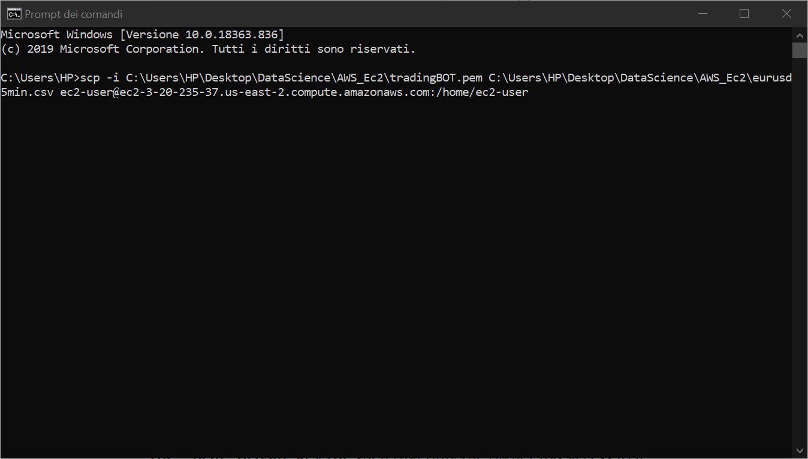

# Running a Python script on AWS EC2 instance

This is "manual" to create an instance in the AWS cloud and then to be able to run a python script on it.

First, to clarify, an instance is a virtual server in the AWS cloud.

**Note**: I’m running Windows 10 on my computer and i’ll be using the Amazon Linux AMI for the EC2 instance.

# Creating and launching an AWS EC2 Instance

### Ceate an EC2 Instance
**1.** Head over to [AWS Website](https://aws.amazon.com/) and log into the AWS Console, if you already have an account. If you do not have an account yet, sign up for one.
You need your credit card details to sign-up, even for the free basic plan. They won’t charge you anything unless you go over their free-tier limits, which is something you definitely need to keep track of if you are working on a large scale project but otherwise the free-tier gives you plenty to work with.

**2.** Now click on services and then select **EC2**. Then click on the Launch Instance button.

**3.** Next you get to **choose an AMI (Amazon Machine Image)**, which contains the software configuration i.e. the operating system, application server, and applications that are required to launch the instance.
In this post i will be using the **Amazon Linux AMI 2018.03.0** image.

**4.** Select the instance type, t2.micro is the only instance available for free tier and it gives you a memory of 1 GB. Hit on Review and Launch and then Launch again on the following page.

**5.** Next you need to create a key pair that will allow you to connect to your instance securely. Select *“Create a new key pair”*, give it a name and then make sure you download the key pair, this will give you a *“.pem”* file, you will need this to connect to your instance later on. After downloading the key pair, launch the instance.

**6.** On the next page, scroll down and click on *“View Instances”*. It might take a little while for the initialization. After the initialization is done, your instance should be up and running.

Now that we have created the EC2 instance on AWS and it is up and running, we need to connect to the instance. To do this we need an ssh client and the easiest option on windows to do this is Putty, so download it from the [Putty Website](https://www.putty.org/)

### Connecting to the EC2 Instance.

*1.* **Install Putty** on your local machine. Before connecting to the instance, we need to convert the key pair in the *“.pem”* file to a *“.ppk”* file so that Putty can understand it.

*2.* **Open Puttygen** which should come pre-installed when you install Putty.

*3.* Click on **Load and select the key pair**, the *“.pem”* file, Hit Ok and then click on *“Save Private Key”* and save it as a *“.ppk”* file.

*4.* Now, Open Putty. To connect to our EC2 instance we need it’s Host Name. You can find this on the Instances page on AWS, for my instance it is as follows, Public DNS (IPv4): *“ec2-3-20-235-37.us-east-2.compute.amazonaws.com”*. You also need to specify the user on that instance, so to the public dns add *“ec2-user@”* as a prefix. The user is different for each AMI, for the Amazon Linux AMI it is *“ec2-user@”*. Make sure the port is *22* which it should be by default.

*5.* Next, under the *“Category”* pane on the left hand side, expand *“SSH”* and then select *“Auth”*. Under *“Authentication Parameters”*, Browse for the *“.ppk”* file you created in Step-3 and select it. Now go back to *“Session”* in the *“Category”* pane on the left.

*6.* You can **save this session configuration** so that you don’t have to type in everything again the next time you connect. So, type in a name under “Saved Sessions” and then click “Save”. Next time you want to launch it, just select the session and click on *“Load”*, it should also load the *“.ppk”* file automatically for authentication. But be careful that if you stop the instance and you restar a new one the *Public DNS (IPv4)* will be different. 

*6.* Click *Open*. The Putty terminal should open up and you will also get a Security Warning, You don’t need to worry about this, just click *“Yes”*.

If everything works perfectly, you will be connected to your EC2- instance and you see should see something like this on your screen.

### Run Python on AWS EC2 Instance

Now let’s see how we can setup a python environment, transfer python scripts from your local machine to the remote instance and run them.

To see everything that’s installed in your instance, type in the following commands:

*cd /usr/bin/*

*ls*

*1.* You will probably see python 2.7 already installed which is the older version, so let’s go ahead and **install python 3.6**.

*sudo yum install python36*

Even after installing python 3.6, running *python --version* in the Putty terminal still points to python 2.7, let’s change that.

*sudo alternatives --set python /usr/bin/python3.6*

*python --version*

*2.* Next we want to **install pip3** that we will use to install python packages.

*cd /tmp*

*curl -O https://bootstrap.pypa.io/get-pip.py*

*python3 get-pip.py --user*

*pip3 --version*

Now we can use pip3 to install python packages. If you want to install the numpy package, run the following in your Putty terminal.

*pip3 install numpy --user*

Let’s *transfer a python script from our local machine onto the EC2 instance* and try running it.

*1.* First open up a **windows terminal** on your machine using *cmd*.

*2.* Use **scp (Secure Copy Protocol)** to transfer files between the local and the remote host. The scp command has three arguments, the first argument is the file path to the private key *“.pem”* file, the second argument is the path to the location of the file you want to copy from your machine, and the third argument is the path to the location on the instance where you want to copy it. In my case I wanted to transfer *BOT.py* so my command looked like this:

Make sure you run this in a windows command line terminal and not the Putty terminal.

*3.*Now connect to the EC2 instance in Putty and type in *ls* , this gives you the list of all files in the current working directory. Run that script using python *your_file_name.py* and you should see the output.

If you want to open the python file, see it’s content and make changes to it you can use the following Linux commands in the Putty terminal.

*vi your_file_name.py* opens up the python script for viewing. If you want to edit the file hit *i* then edit the file using your keyboard, after you are done making changes, hit the escape key then type in *:wq* and hit the enter key, to write the changes to the file and quit.

